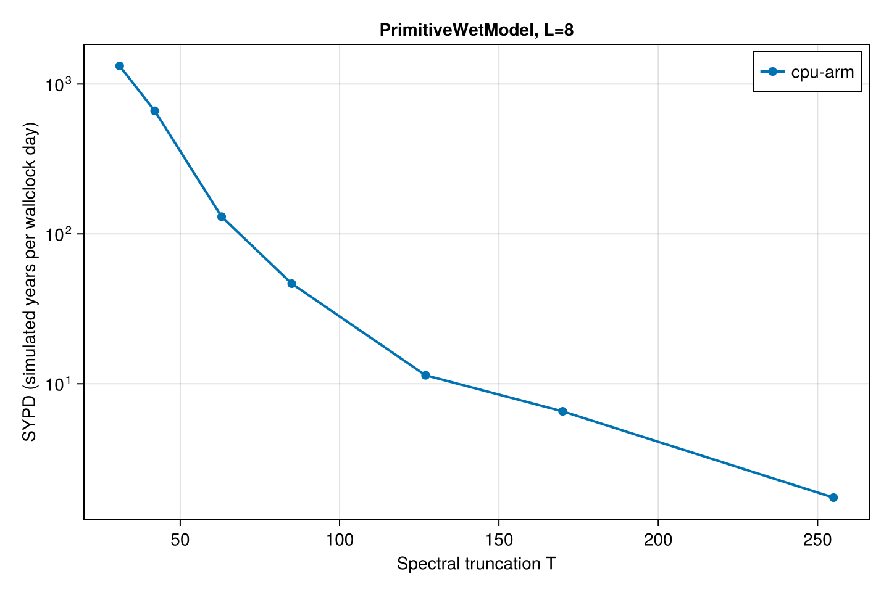
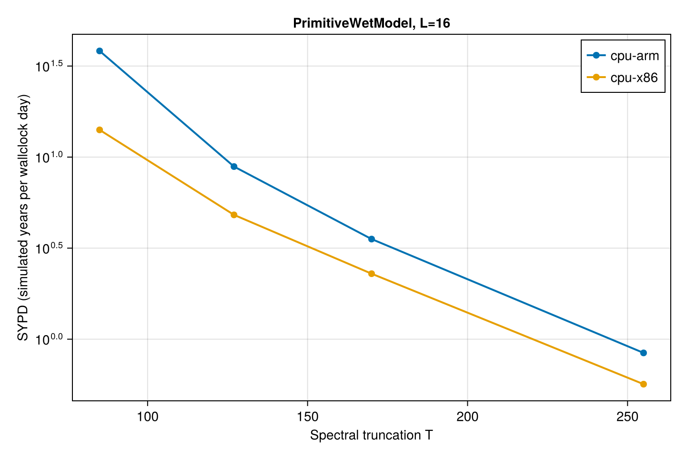

# Benchmarks

Performance benchmarks for SpeedyWeather.jl, collected across multiple architectures. Each architecture's results live in its own section below; the overview table at the top compares the headline PrimitiveWet resolution sweep across all archs that have been benchmarked so far.

All simulations are benchmarked over several seconds (wallclock time) without output. Benchmarking excludes initialization and is started just before the main time loop and finishes right after. The benchmarking results here are not very robust; timings that change by ±50% are not uncommon. Proper benchmarking for performance optimization uses the minimum or median of many executions, while we run a simulation for several time steps which effectively represents the mean, susceptible to outliers. However, this is what a user will experience in most situations anyway and the following therefore presents a rough idea of how fast a SpeedyWeather simulation will run, and how much memory it requires.

### Explanation

Abbreviations in the tables below are as follows; omitted columns use defaults.
- NF: Number format, default: Float32
- T: Spectral resolution, maximum degree of spherical harmonics, default: T31
- L: Number of vertical layers, default: 8 (for 3D models)
- Grid: Horizontal grid, default: OctahedralGaussianGrid
- Rings: Grid-point resolution, number of latitude rings pole to pole
- Dynamics: With dynamics?, default: true
- Physics: With physical parameterizations?, default: true (for primitive equation models)
- Δt: time step [s].
- SYPD: Speed of simulation, simulated years per wallclock day.
- Memory: Memory footprint of simulation, variables and constants.

### Running the benchmarks

Reproduce the benchmark suite by running, from `SpeedyWeather/benchmark`:

```
julia --project=. manual_benchmarking.jl                # CPU (auto-labelled cpu-arm or cpu-x86)
julia --project=. manual_benchmarking.jl gpu            # CUDA GPU
julia --project=. manual_benchmarking.jl reactant-cpu   # Reactant on CPU
julia --project=. manual_benchmarking.jl reactant-gpu   # Reactant on CUDA GPU
```

Each run updates only its own architecture's section in this `README.md`; results for other architectures are preserved via `benchmark_results.json`.

## Overview: PrimitiveWet resolution across architectures

Simulated years per wallclock day (SYPD) for the `PrimitiveWetModel` resolution sweep, one column per architecture. Empty cells mean the architecture has not yet been benchmarked or that suite was skipped.





| T | L | cpu-arm |
| - | - | - |
| 31 | 8 | 1321 |
| 42 | 8 | 663 |
| 63 | 8 | 130 |
| 85 | 8 | 47 |
| 85 | 16 | 38 |
| 127 | 8 | 11 |
| 127 | 16 | 9 |
| 170 | 8 | 7 |
| 170 | 16 | 4 |
| 255 | 8 | 2 |
| 255 | 16 | 1 |

## Architecture: `cpu-arm`

Created for SpeedyWeather.jl v0.20.1+DEV on Fri, 22 May 2026 15:08:39.

### Machine details

```julia
julia> versioninfo()
Julia Version 1.11.7
Commit f2b3dbda30a (2025-09-08 12:10 UTC)
Build Info:
  Official https://julialang.org/ release
Platform Info:
  OS: macOS (arm64-apple-darwin24.0.0)
  CPU: 8 × Apple M3
  WORD_SIZE: 64
  LLVM: libLLVM-16.0.6 (ORCJIT, apple-m2)
Threads: 1 default, 0 interactive, 1 GC (on 4 virtual cores)
```


### Models, default setups

| Model | T | L | Physics | Δt | SYPD | Memory|
| - | - | - | - | - | - | - |
| BarotropicModel | 31 | 1 | false | 2400 | 39140 | 688.34 KB |
| ShallowWaterModel | 31 | 1 | false | 2400 | 23924 | 822.86 KB |
| PrimitiveDryModel | 31 | 8 | true | 2400 | 1371 | 4.16 MB |
| PrimitiveWetModel | 31 | 8 | true | 2400 | 1308 | 4.84 MB |

### Shallow water model, resolution

| Model | T | L | Rings | Δt | SYPD | Memory|
| - | - | - | - | - | - | - |
| ShallowWaterModel | 31 | 1 | 48 | 2400 | 25950 | 822.86 KB |
| ShallowWaterModel | 42 | 1 | 64 | 1800 | 10033 | 1.44 MB |
| ShallowWaterModel | 63 | 1 | 96 | 1200 | 3578 | 3.25 MB |
| ShallowWaterModel | 85 | 1 | 128 | 900 | 1420 | 5.94 MB |
| ShallowWaterModel | 127 | 1 | 192 | 600 | 228 | 14.14 MB |
| ShallowWaterModel | 170 | 1 | 256 | 450 | 116 | 26.86 MB |
| ShallowWaterModel | 255 | 1 | 384 | 300 | 27 | 68.30 MB |

### Primitive wet model, resolution

| Model | T | L | Rings | Δt | SYPD | Memory|
| - | - | - | - | - | - | - |
| PrimitiveWetModel | 31 | 8 | 48 | 2400 | 1321 | 4.84 MB |
| PrimitiveWetModel | 42 | 8 | 64 | 1800 | 663 | 8.18 MB |
| PrimitiveWetModel | 63 | 8 | 96 | 1200 | 130 | 17.42 MB |
| PrimitiveWetModel | 85 | 8 | 128 | 900 | 47 | 30.35 MB |
| PrimitiveWetModel | 127 | 8 | 192 | 600 | 11 | 67.03 MB |
| PrimitiveWetModel | 170 | 8 | 256 | 450 | 7 | 119.25 MB |
| PrimitiveWetModel | 255 | 8 | 384 | 300 | 2 | 272.27 MB |
| PrimitiveWetModel | 85 | 16 | 128 | 900 | 38 | 51.65 MB |
| PrimitiveWetModel | 127 | 16 | 192 | 600 | 9 | 113.22 MB |
| PrimitiveWetModel | 170 | 16 | 256 | 450 | 4 | 200.00 MB |
| PrimitiveWetModel | 255 | 16 | 384 | 300 | 1 | 450.63 MB |

### Primitive Equation, Float32 vs Float64

| Model | NF | T | L | Δt | SYPD | Memory|
| - | - | - | - | - | - | - |
| PrimitiveWetModel | Float32 | 31 | 8 | 2400 | 1131 | 4.84 MB |
| PrimitiveWetModel | Float64 | 31 | 8 | 2400 | 1196 | 9.00 MB |

### Grids

| Model | T | L | Grid | Rings | Δt | SYPD | Memory|
| - | - | - | - | - | - | - | - |
| PrimitiveWetModel | 63 | 8 | FullGaussianGrid | 96 | 1200 | 87 | 25.36 MB |
| PrimitiveWetModel | 63 | 8 | FullClenshawGrid | 95 | 1200 | 117 | 25.14 MB |
| PrimitiveWetModel | 63 | 8 | OctahedralGaussianGrid | 96 | 1200 | 149 | 17.42 MB |
| PrimitiveWetModel | 63 | 8 | OctahedralClenshawGrid | 95 | 1200 | 95 | 17.18 MB |
| PrimitiveWetModel | 63 | 8 | HEALPixGrid | 95 | 1200 | 254 | 12.73 MB |
| PrimitiveWetModel | 63 | 8 | OctaHEALPixGrid | 95 | 1200 | 97 | 15.50 MB |

### Number of vertical layers

| Model | T | L | Δt | SYPD | Memory|
| - | - | - | - | - | - |
| PrimitiveWetModel | 31 | 4 | 2400 | 2158 | 3.11 MB |
| PrimitiveWetModel | 31 | 8 | 2400 | 1345 | 4.84 MB |
| PrimitiveWetModel | 31 | 12 | 2400 | 963 | 6.58 MB |
| PrimitiveWetModel | 31 | 16 | 2400 | 788 | 8.33 MB |

### PrimitiveDryModel: Physics or dynamics only

| Model | T | L | Dynamics | Physics | Δt | SYPD | Memory|
| - | - | - | - | - | - | - | - |
| PrimitiveDryModel | 31 | 8 | true | true | 2400 | 2259 | 4.16 MB |
| PrimitiveDryModel | 31 | 8 | true | false | 2400 | 4498 | 4.16 MB |
| PrimitiveDryModel | 31 | 8 | false | true | 2400 | 3366 | 4.16 MB |

### PrimitiveWetModel: Physics or dynamics only

| Model | T | L | Dynamics | Physics | Δt | SYPD | Memory|
| - | - | - | - | - | - | - | - |
| PrimitiveWetModel | 31 | 8 | true | true | 2400 | 1485 | 4.84 MB |
| PrimitiveWetModel | 31 | 8 | true | false | 2400 | 2710 | 4.84 MB |
| PrimitiveWetModel | 31 | 8 | false | true | 2400 | 1925 | 4.84 MB |

### Individual dynamics functions


#### PrimitiveWetModel | Float32 | T31 L8 | OctahedralGaussianGrid | 48 Rings

| Function | Time | Memory | Allocations |
| - | - | - | - |
| pressure_gradient_flux! | 41.000 μs| 100.28 KiB| 790 |
| linear_virtual_temperature! | 1.754 μs| 0 bytes| 0 |
| geopotential! | 6.242 μs| 5.61 KiB| 23 |
| vertical_integration! | 14.042 μs| 0 bytes| 0 |
| surface_pressure_tendency! | 15.333 μs| 24.66 KiB| 288 |
| vertical_velocity! | 48.125 μs| 384.31 KiB| 12 |
| linear_pressure_gradient! | 1.750 μs| 0 bytes| 0 |
| vertical_advection! | 71.167 μs| 8.62 KiB| 100 |
| vordiv_tendencies! | 296.541 μs| 259.66 KiB| 724 |
| temperature_tendency! | 312.334 μs| 381.95 KiB| 1027 |
| humidity_tendency! | 288.083 μs| 380.59 KiB| 1017 |
| bernoulli_potential! | 99.166 μs| 510.22 KiB| 345 |

