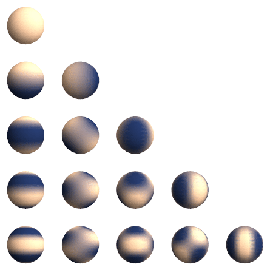

# Spherical Harmonic Transform

The following sections outline the implementation of the spherical harmonic transform (in short _spectral_ transform)
between the coefficients of the spherical harmonics (the _spectral_ space) and the grid space on a longitude-latitude
[regular Gaussian grid](https://confluence.ecmwf.int/display/FCST/Gaussian+grids).

## Inspiration

The spectral transform implemented by SpeedyWeather.jl follows largely Justin Willmert's
[CMB.jl](https://github.com/jmert/CMB.jl) package and makes use of
[AssociatedLegendrePolynomials.jl](https://github.com/jmert/AssociatedLegendrePolynomials.jl) and
[FFTW.jl](https://github.com/JuliaMath/FFTW.jl) (for `Float32/64`) or [FastTransforms.jl](https://github.com/JuliaApproximation/FastTransforms.jl) (for generic) for the Fourier transform. Justin described his work in a Blog series [^1][^2][^3][^4][^5][^6][^7][^8].

## Spherical harmonics

The [spherical harmonics](https://en.wikipedia.org/wiki/Spherical_harmonics) ``Y_{lm}`` of degree ``l`` and order ``m``
over the longitude ``\phi = (0,2\pi)`` and colatitudes ``\theta = (0,\pi)`` (north to south), are

```math
Y_{lm}(\phi, \theta) = \lambda_l^m(\cos\theta) e^{im\phi}
```

with ``\lambda_l^m`` being the pre-normalized associated Legendre polynomials, and ``e^{im\phi}`` are the
complex exponentials (the Fourier modes). Together they form a set of orthogonal basis functions on the sphere.
For an interactive visualisation of the spherical harmonics, see
[here](https://justinwillmert.com/posts/2020/plots-of-the-spherical-harmonics-eigenmodes/).

!!! info "Latitudes versus colatitudes"
    The spherical transforms in SpeedyWeather.jl use colatitudes ``\theta = (0,\pi)`` (north to south) but the dynamical core
    uses latitudes ``\theta = (-\pi/2,\pi/2)`` (south to north). However, all arrays are always sorted south to north such that
    `[i,1]` will access the southern-most grid points. Note: This may change in the future for consistency. 

## Synthesis (spectral to grid)

The synthesis (or inverse transform) takes the spectral coefficients ``a_{lm}`` and transforms them to grid-point values
``f(\phi,\theta)``. The synthesis is a linear combination of the spherical harmonics ``Y_{lm}`` with non-zero coefficients.

```math
f(\phi,\theta) = \sum_{l=0}^{l_{max}} \sum_{m=-l}^l a_{lm} Y_{lm}(\phi,\theta)
```

## Analysis (grid to spectral)

```math
\hat{a}_{lm} = \sum_{i=1}^N f(\phi_i,\theta_i) Y_{lm}(\phi_i,\theta_i) \sin(\theta_i) \Delta \phi_i \Delta \theta_i
```

## Spectral packing

Spectral packing is the way how the coefficients ``a_{lm}`` of the spherical harmonics of a given spectral field are
stored in an array. SpeedyWeather.jl uses the conventional spectral packing of degree ``l`` and order ``m`` as
illustrated in the following image
[(Cyp, CC BY-SA 3.0, via Wikimedia Commons)](https://commons.wikimedia.org/wiki/File:Rotating_spherical_harmonics.gif)
```@raw html

```
Every row represents an order ``l \leq 0``, starting from ``l=0`` at the top. Every column represents an order
``m\leq 0``, starting from ``m=0`` on the left. The coefficients of these spherical harmonics are directly
mapped into a matrix ``a_{lm}`` as 

|     |``m``     |          |          |          |
| :-: | :------: | :------: | :------: | :------: | 
|``l``|``a_{00}``|          |          |          |
|     |``a_{10}``|``a_{11}``|          |          |
|     |``a_{20}``|``a_{12}``|``a_{22}``|          |
|     |``a_{30}``|``a_{13}``|``a_{23}``|``a_{33}``|

which is consistently extended for higher degrees and orders. Consequently, all spectral fields are lower-triangular matrices
with complex entries. The upper triangle excluding the diagnol explicitly stores zeros. Note that internally some fields may
include an additional degree, such that ``l_{max} = m_{max} + 1`` (see [Gradients in spectral space](@ref) for more information).
The harmonics with ``a_{l0}`` (the first column) are also called _zonal_ harmonics as they are constant with longitude ``\phi``.
The harmonics with ``a_{ll}`` (the main diagonal) are also called _sectoral_ harmonics as they essentially split the sphere
into ``2l`` sectors in longitude ``\phi`` without a zero-crossing in latitude.

!!! info "Array indices"
    For a spectral field `alms` note that due to Julia's 1-based indexing the coefficient ``a_{lm}`` is obtained via
    `alms[l+1,m+1]`.

Fortran speedy does not use the same spectral packing as SpeedyWeather.jl. The alternative packing ``l',m'`` therein
uses ``l'=m`` and ``m'=l-m`` as summarized in the following table.

| degree ``l`` | order ``m`` |  ``l'=m`` |  ``m'=l-m`` |
| :----------: | :---------: | :-------: | :---------: |
|0             |0            |0          |0            |
|1             |0            |0          |1            |
|1             |1            |1          |0            |
|2             |0            |0          |2            |
|2             |1            |1          |1            |
|2             |2            |2          |0            |
|3             |0            |0          |3            |
|...           |...          |...        |...          |


This alternative packing uses the top-left triangle of a coefficient matrix, and the degrees and orders from above are
stored at the following indices

|      |``m'``    |          |          |          |
| :--: | :-:      | :-------:| :-------:| :-------:| 
|``l'``|``a_{00}``|``a_{10}``|``a_{20}``|``a_{30}``|
|      |``a_{11}``|``a_{21}``|``a_{31}``|          |
|      |``a_{22}``|``a_{32}``|          |          |
|      |``a_{33}``|          |          |          |

This spectral packing is not used in SpeedyWeather.jl but illustrated here for completeness and comparison with
Fortran-speedy.

### Example transforms

```julia
julia> using SpeedyWeather
julia> alms = zeros(ComplexF64,3,3)    # spectral coefficients
julia> alms[2,2] = 1                   # only l=1,m=1 harmonic
julia> map = gridded(alms)             # convert to grid space
8×4 Matrix{Float64}:
 -0.324541  -0.600363  -0.600363  -0.324541
 -0.134429  -0.248678  -0.248678  -0.134429
  0.134429   0.248678   0.248678   0.134429
  0.324541   0.600363   0.600363   0.324541
  0.324541   0.600363   0.600363   0.324541
  0.134429   0.248678   0.248678   0.134429
 -0.134429  -0.248678  -0.248678  -0.134429
 -0.324541  -0.600363  -0.600363  -0.324541
 
julia> spectral(map)                   # back to spectral space
3×3 Matrix{ComplexF64}:
 0.0+0.0im  0.0+0.0im          0.0+0.0im
 0.0+0.0im  1.0+3.60727e-17im  0.0+0.0im
 0.0+0.0im  0.0+0.0im          0.0+0.0im
```

and we have successfully reobtained the ``l=m=1`` spherical harmonic.

## Available horizontal resolutions

SpeedyWeather.jl uses triangular truncation such that only spherical harmonics with ``l \leq l_{max}`` and ``|m| \leq m_{max}``
are explicitly represented. This is usually described as ``Tm_{max}``, with ``l_{max} = m_{max}`` (although in vector quantities
require one more degree ``l`` in the recursion relation of meridional gradients). For example, T31 is the spectral resolution
with ``l_{max} = m_{max} = 31``. Note that the degree ``l`` and order ``m`` are mathematically 0-based, such that the
corresponding coefficient matrix is of size 32x32.

Using triangular truncation[^9], there are constraints on the corresponding grid resolution. Let `nlon`, `nlat` be the number of
longitudes, latitudes on a regular Gaussian grid. Then spectral and grid resolution have to be chosen such that

- ``nlon \geq 3l_{max}+1``
- ``nlat \geq (3l_{max}+1)/2``

In general, we choose ``nlon = 2nlat``, and ideally ``nlon`` is easily Fourier-transformable, e.g. ``nlon = 2^i3^j5^k`` with some
integers ``i,j,k``. SpeedyWeather.jl is tested at the following horizontal resolutions, with ``\Delta x`` as the approximate grid
spacing at the Equator (``2\pi R / nlon``)

| ``l_{max}``   | nlon | nlat | ``\Delta x`` |
| ------------- | ---- | ---- | ------------ |
| 31 (default)  | 96   | 48   | 400 km       |
| 42            | 128  | 64   | 300 km       |
| 85            | 256  | 128  | 160 km       |
| 170           | 512  | 256  | 80 km        |
| 341           | 1024 | 512  | 40 km        |
| 682           | 2048 | 1024 | 20 km        |

Choosing `trunc` as argument in `run_speedy` will automatically choose `nlon`,`nlat` as presented in the table.
Other common choices are T63 (192x96), T127 (384x192), T255 (768x384), T511 (1536x768), among others.

## Gradients in spectral space

Gradients in spectral space are discussed in the following using the conversion between the stream function ``\Psi``
and the zonal and meridional velocity components ``u,v`` as an example.

```math
\begin{aligned}
u &= -\frac{1}{R}\frac{\partial \Psi}{\partial \theta} \\
v &= \frac{1}{R \cos(\theta)}\frac{\partial \Psi}{\partial \phi} \\
\end{aligned}
```

The radius of the sphere (i.e. Earth) is ``R``, ``\theta`` the latitude and ``\phi`` the longitude. So the zonal
velocity ``u`` is the (negative) meridional gradient of the stream function ``\Psi``, and the meridional
velocity ``v`` is the zonal gradient of ``\Psi``. The zonal gradient scales with ``1/\cos(\theta)`` as the 
longitudes converge towards the poles (note that ``\theta`` describes latitudes here, defintions using colatitudes
replace the ``\cos`` with a ``\sin``.)

### Zonal derivative

The zonal derivative of a field ``\Psi`` in spectral space is the zonal derivative of all its respective
spherical harmonics ``\Psi_{lm}(\phi,\theta)``.

```math
v_{lm} = \frac{1}{R \cos(\theta)} \frac{\partial}{\partial \phi} \left( \lambda_l^m(\cos\theta) e^{im\phi} \right)
  = \frac{im}{R \cos(\theta)} \lambda_l^m(\cos\theta) e^{im\phi} = \frac{im}{R \cos(\theta)} \Psi_{lm}
```

So for every spectral harmonic, ``\cos(\theta)v_{lm}`` is obtained from ``\Psi_{lm}`` via a multiplication
with ``im/R``. Unscaling the ``\cos(\theta)``-factor is usually done after transforming
the spectral coefficients ``v_{lm}`` into grid-point space. As discussed in [Radius scaling](@ref), SpeedyWeather.jl
scales the stream function as ``\tilde{\Psi} = R^{-1}\Psi`` such that the division by radius ``R`` in the gradients
can be omitted. The zonal derivative becomes therefore effectively for each spherical harmonic a scaling with its
(imaginary) order ``im``. The spherical harmonics are essentially just a Fourier transform
in zonal direction and the derivative a multiplication with the respective wave number ``m`` times imaginary ``i``.

### Meridional derivative

The meridional derivative of a field ``\Psi`` in spectral space is more complicated than the zonal derivative.
To obtain the coefficient of each spherical harmonic of the meridional gradient of a spectral field, two 
coefficients have to be combined following a recursion relation

```math
(\cos(\theta)u)_{l,m} = -\frac{1}{R}(-(l-1)\epsilon_{l,m}\Psi_{l-1,m} + (l+2)\epsilon_{l+1,m}\Psi_{l+1,m})
```

Here we used the example of obtaining the zonal velocity ``u`` from the stream function ``\Psi``, which is through the
negative meridional gradient. For the meridional derivative itself the leading minus sign has to be omitted.
The recursion factors are

```math
\epsilon_{l,m} = \sqrt{\frac{l^2-m^2}{4l^2-1}}
```

The recursion relation means that the coefficient of a gradient ``u_{lm}`` is a linear combination of the coefficients
of one higher and one lower degree ``\Psi_{l+1,m},\Psi_{l-1,m}``. As the coefficient ``\Psi_{lm}`` with ``m<l`` are
zero, the sectoral harmonics (``l=m``) of the gradients are obtained from the first off-diagonal only. However,
the ``l=l_{max}`` harmonics of the gradients require the ``l_{max}-1`` as well as the ``l_{max}+1`` harmonics.
In SpeedyWeather.jl vector quantities like ``u,v`` use therefore one more meridional mode than scalar quantities
such as vorticity ``\zeta`` or stream function ``\Psi``. The meridional derivative in SpeedyWeather.jl also
omits the ``1/R``-scaling as explained for the [Zonal derivative](@ref) and in [Radius scaling](@ref).

### Laplacian

The spectral Laplacian is easily applied to the coefficients ``\Psi_{lm}`` of a spectral field
as the spherical harmonics are eigenfunctions of the Laplace operator ``\nabla^2`` in spherical coordinates with
eigenvalues ``-l(l+1)`` divided by the radius squared ``R^2``, i.e. ``\nabla^2 \Psi`` becomes ``\tfrac{-l(l+1)}{R^2}\Psi_{lm}``
in spectral space. For example, vorticity ``\zeta`` and streamfunction ``\Psi`` are related by ``\zeta = \nabla^2\Psi``
in the barotropic vorticity model. Hence, in spectral space this is equivalent for every spectral mode of
degree ``l`` and order ``m`` to

```math
\zeta_{l,m} = \frac{-l(l+1)}{R^2}\Psi_{l,m}
```

This can be easily inverted to obtain the stream function ``\Psi`` from vorticity ``\zeta`` instead. In order to avoid
division by zero, we set ``\Psi_{0,0}`` here, given that the stream function is only defined up to a constant anyway.

See also [Horizontal diffusion](@ref) and [Normalization of diffusion](@ref).

## References
[^1]: Justin Willmert, 2020. [Introduction to Associated Legendre Polynomials (Legendre.jl Series, Part I)](https://justinwillmert.com/articles/2020/introduction-to-associated-legendre-polynomials/)
[^2]: Justin Willmert, 2020. [Calculating Legendre Polynomials (Legendre.jl Series, Part II)](https://justinwillmert.com/articles/2020/calculating-legendre-polynomials/)
[^3]: Justin Willmert, 2020. [Pre-normalizing Legendre Polynomials (Legendre.jl Series, Part III)](https://justinwillmert.com/articles/2020/pre-normalizing-legendre-polynomials/)
[^4]: Justin Willmert, 2020. [Maintaining numerical accuracy in the Legendre recurrences (Legendre.jl Series, Part IV)](https://justinwillmert.com/articles/2020/maintaining-numerical-accuracy-in-the-legendre-recurrences/)
[^5]: Justin Willmert, 2020. [Introducing Legendre.jl (Legendre.jl Series, Part V)](https://justinwillmert.com/articles/2020/introducing-legendre.jl/)
[^6]: Justin Willmert, 2020. [Numerical Accuracy of the Spherical Harmonic Recurrence Coefficient (Legendre.jl Series Addendum)](https://justinwillmert.com/posts/2020/pre-normalizing-legendre-polynomials-addendum/)
[^7]: Justin Willmert, 2020. [Notes on Calculating the Spherical Harmonics](https://justinwillmert.com/articles/2020/notes-on-calculating-the-spherical-harmonics)
[^8]: Justin Willmert, 2022. [More Notes on Calculating the Spherical Harmonics: Analysis of maps to harmonic coefficients](https://justinwillmert.com/articles/2022/more-notes-on-calculating-the-spherical-harmonics/)
[^9]: David Randall, 2021. [An Introduction to Numerical Modeling of the Atmosphere](http://hogback.atmos.colostate.edu/group/dave/at604pdf/An_Introduction_to_Numerical_Modeling_of_the_Atmosphere.pdf), Chapter 22.